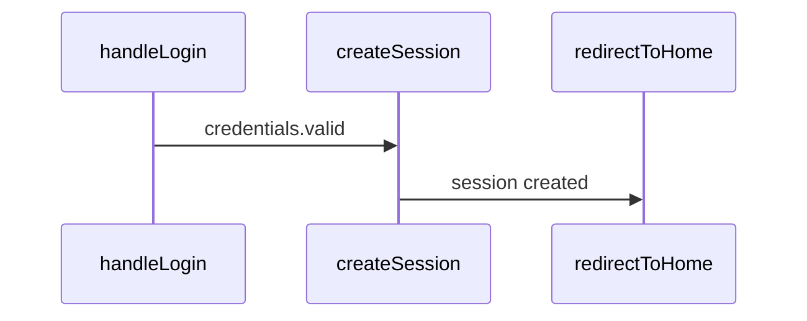

# Semantic Static Tracing Guide

Статический анализ потока выполнения кода без его запуска.

## Когда использовать

| Вопрос | Инструмент | Что получишь |
|--------|------------|--------------|
| "Как код попадает от A к B?" | `trace_flow` | Пути, состояния, условия, Mermaid диаграмма |
| "Почему метод не вызывается?" | `trace_backwards` | Вызывающие, блокирующие условия, диагноз |
| "Как данные влияют на состояние?" | `trace_data_flow` | Источники, трансформации, матрица поведения |
| "Что изменится при другом значении?" | `analyze_state_impact` | Сценарии, конфликты, ripple effects |
| "Какие условия влияют на сценарий?" | `find_decision_points` | Точки решений с классификацией |

## trace_flow — Трассировка от A к B

Найти все пути выполнения между двумя точками:

```typescript
trace_flow({
  from: "handleLogin",
  to: "redirectToHome",
  trackStates: true,     // Отслеживать изменения состояний
  trackConditions: true, // Отслеживать ветвления
  maxDepth: 15,
  format: "mermaid"      // sequence | tree | graph | mermaid
})
```

**Возвращает:**
- Пути с confidence scores
- Изменения состояний на каждом шаге
- Условия и ветвления
- Mermaid sequence diagram

## trace_backwards — Обратная трассировка

Понять почему метод не вызывается или что на него влияет:

```typescript
trace_backwards({
  target: "FinishTask",
  question: "why_not_called", // | "what_affects" | "dependencies"
  depth: 15,
  includeStates: true
})
```

**Типы вопросов:**
- `why_not_called` — найти блокирующие условия
- `what_affects` — все зависимости
- `dependencies` — полный граф зависимостей

**Возвращает:**
- Список вызывающих с вероятностями (always/conditional/rare)
- Блокирующие условия с рекомендациями
- Зависимости от состояний
- Цепочки вызовов
- Диагноз с suggested debug points

## trace_data_flow — Поток данных

Проследить как данные влияют на целевое состояние:

```typescript
trace_data_flow({
  entryPoint: "AppInit",
  targetState: "startPage",
  dataSources: ["config", "api:fetchUser"], // auto-detect если пусто
  trackTransformations: true
})
```

**Источники данных (auto-detect):**
- API: fetch, axios, http
- Storage: localStorage, database
- Props: props, input, param
- State: state, store, redux
- Config: config, settings, env

**Возвращает:**
- Потоки данных от источников
- Трансформации (parse, map, validate)
- Ветвления на основе данных
- Матрица поведения для разных inputs

## analyze_state_impact — Влияние состояния

Понять как состояние влияет на разные сценарии:

```typescript
analyze_state_impact({
  state: "user.isAuthenticated",
  scenarios: [
    { value: true, label: "logged in" },
    { value: false, label: "logged out" }
  ]
})
```

**Возвращает:**
- Все использования состояния (read/write/condition)
- Для каждого сценария:
  - Доступные пути
  - Заблокированные пути
  - Включённые фичи
- Конфликты (множественные writers, race conditions)
- Ripple effects (прямое и косвенное влияние)

## find_decision_points — Точки решений

Найти все места где код принимает решения:

```typescript
find_decision_points({
  scenario: "checkout flow",
  includeGuards: true,
  includeEffects: true,
  groupBy: "impact" // | "location" | "type"
})
```

**Типы точек решений:**
- `validation` — валидация входных данных
- `api_response` — обработка ответов API
- `state_mutation` — изменение состояния
- `guard` — guard условия (early return)
- `loop` — контроль цикла
- `error_handling` — try-catch
- `feature_flag` — переключатели фич

**Уровни влияния:**
- `critical` — блокирует выполнение
- `high` — существенно влияет
- `medium` — умеренное влияние
- `low` — минимальное влияние

**Возвращает:**
- Список точек решений с классификацией
- Mermaid flowchart
- Summary: total, critical, possible outcomes

## Примеры использования

### Отладка: почему не срабатывает?

```typescript
// Шаг 1: Найти блокирующие условия
trace_backwards({
  target: "sendNotification",
  question: "why_not_called"
})
// → Найдёт: "user.preferences.notifications === false" блокирует

// Шаг 2: Проверить влияние настройки
analyze_state_impact({
  state: "user.preferences.notifications",
  scenarios: [
    { value: true, label: "enabled" },
    { value: false, label: "disabled" }
  ]
})
// → Покажет какие пути открыты/закрыты для каждого значения
```

### Понимание: как данные влияют на UI?

```typescript
trace_data_flow({
  entryPoint: "loadDashboard",
  targetState: "dashboardData"
})
// → Покажет: API → parse → validate → setState
// → Матрица: если API error → fallback state
```

### Рефакторинг: где нужно изменить логику?

```typescript
find_decision_points({
  scenario: "user authentication",
  groupBy: "impact"
})
// → Список всех if/switch/guards связанных с auth
// → Сгруппировано по важности
```

## Output форматы

### Text (default)
```
═══ Trace Flow: handleLogin → redirectToHome ═══

Found 2 path(s):

─── Path 1 (confidence: 85%) ───
Summary: Login flow via session creation

  1. → handleLogin (/src/auth.ts:10)
     └─ if: credentials.valid
  2. → createSession (/src/session.ts:5)
     └─ isAuthenticated: false → true
  3. → redirectToHome (/src/router.ts:100)

─── States ───
Modified: isAuthenticated, currentSession
```

### Mermaid


## Интеграция с семантическим поиском

Трассировка автоматически использует семантический поиск (если доступен) для:
- Нечёткого поиска entry/exit points по описанию
- Улучшения качества анализа
- Естественно-языковых запросов

```typescript
trace_flow({
  from: "user login handler",  // Семантический поиск найдёт handleLogin
  to: "home page redirect"     // Найдёт redirectToHome
})
```
