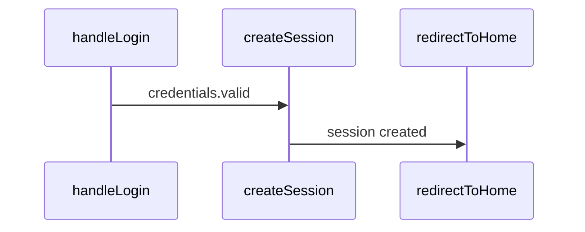

# Semantic Static Tracing Guide

Static analysis of code execution flow without running it.

## When to Use

| Question | Tool | What You Get |
|----------|------|--------------|
| "How does code get from A to B?" | `trace_flow` | Paths, states, conditions, Mermaid diagram |
| "Why isn't the method called?" | `trace_backwards` | Callers, blocking conditions, diagnosis |
| "How does data affect state?" | `trace_data_flow` | Sources, transformations, behavior matrix |
| "What changes with a different value?" | `analyze_state_impact` | Scenarios, conflicts, ripple effects |
| "What conditions affect the scenario?" | `find_decision_points` | Decision points with classification |

## trace_flow — Trace from A to B

Find all execution paths between two points:

```typescript
trace_flow({
  from: "handleLogin",
  to: "redirectToHome",
  trackStates: true,     // Track state changes
  trackConditions: true, // Track branching
  maxDepth: 15,
  format: "mermaid"      // sequence | tree | graph | mermaid
})
```

**Returns:**
- Paths with confidence scores
- State changes at each step
- Conditions and branches
- Mermaid sequence diagram

## trace_backwards — Backward Trace

Understand why a method is not called or what affects it:

```typescript
trace_backwards({
  target: "FinishTask",
  question: "why_not_called", // | "what_affects" | "dependencies"
  depth: 15,
  includeStates: true
})
```

**Question types:**
- `why_not_called` — find blocking conditions
- `what_affects` — all dependencies
- `dependencies` — full dependency graph

**Returns:**
- List of callers with probabilities (always/conditional/rare)
- Blocking conditions with recommendations
- State dependencies
- Call chains
- Diagnosis with suggested debug points

## trace_data_flow — Data Flow

Trace how data affects a target state:

```typescript
trace_data_flow({
  entryPoint: "AppInit",
  targetState: "startPage",
  dataSources: ["config", "api:fetchUser"], // auto-detect if empty
  trackTransformations: true
})
```

**Data sources (auto-detect):**
- API: fetch, axios, http
- Storage: localStorage, database
- Props: props, input, param
- State: state, store, redux
- Config: config, settings, env

**Returns:**
- Data flows from sources
- Transformations (parse, map, validate)
- Data-based branching
- Behavior matrix for different inputs

## analyze_state_impact — State Impact

Understand how state affects different scenarios:

```typescript
analyze_state_impact({
  state: "user.isAuthenticated",
  scenarios: [
    { value: true, label: "logged in" },
    { value: false, label: "logged out" }
  ]
})
```

**Returns:**
- All state usages (read/write/condition)
- For each scenario:
  - Available paths
  - Blocked paths
  - Enabled features
- Conflicts (multiple writers, race conditions)
- Ripple effects (direct and indirect impact)

## find_decision_points — Decision Points

Find all places where code makes decisions:

```typescript
find_decision_points({
  scenario: "checkout flow",
  includeGuards: true,
  includeEffects: true,
  groupBy: "impact" // | "location" | "type"
})
```

**Decision point types:**
- `validation` — input data validation
- `api_response` — API response handling
- `state_mutation` — state change
- `guard` — guard conditions (early return)
- `loop` — loop control
- `error_handling` — try-catch
- `feature_flag` — feature toggles

**Impact levels:**
- `critical` — blocks execution
- `high` — significant impact
- `medium` — moderate impact
- `low` — minimal impact

**Returns:**
- List of decision points with classification
- Mermaid flowchart
- Summary: total, critical, possible outcomes

## Usage Examples

### Debugging: why doesn't it trigger?

```typescript
// Step 1: Find blocking conditions
trace_backwards({
  target: "sendNotification",
  question: "why_not_called"
})
// -> Finds: "user.preferences.notifications === false" is blocking

// Step 2: Check the setting's impact
analyze_state_impact({
  state: "user.preferences.notifications",
  scenarios: [
    { value: true, label: "enabled" },
    { value: false, label: "disabled" }
  ]
})
// -> Shows which paths are open/closed for each value
```

### Understanding: how does data affect UI?

```typescript
trace_data_flow({
  entryPoint: "loadDashboard",
  targetState: "dashboardData"
})
// -> Shows: API -> parse -> validate -> setState
// -> Matrix: if API error -> fallback state
```

### Refactoring: where does the logic need to change?

```typescript
find_decision_points({
  scenario: "user authentication",
  groupBy: "impact"
})
// -> List of all if/switch/guards related to auth
// -> Grouped by importance
```

## Output Formats

### Text (default)
```
=== Trace Flow: handleLogin -> redirectToHome ===

Found 2 path(s):

--- Path 1 (confidence: 85%) ---
Summary: Login flow via session creation

  1. -> handleLogin (/src/auth.ts:10)
     +- if: credentials.valid
  2. -> createSession (/src/session.ts:5)
     +- isAuthenticated: false -> true
  3. -> redirectToHome (/src/router.ts:100)

--- States ---
Modified: isAuthenticated, currentSession
```

### Mermaid


## Integration with Semantic Search

Tracing automatically uses semantic search (if available) for:
- Fuzzy search of entry/exit points by description
- Improved analysis quality
- Natural language queries

```typescript
trace_flow({
  from: "user login handler",  // Semantic search will find handleLogin
  to: "home page redirect"     // Will find redirectToHome
})
```
